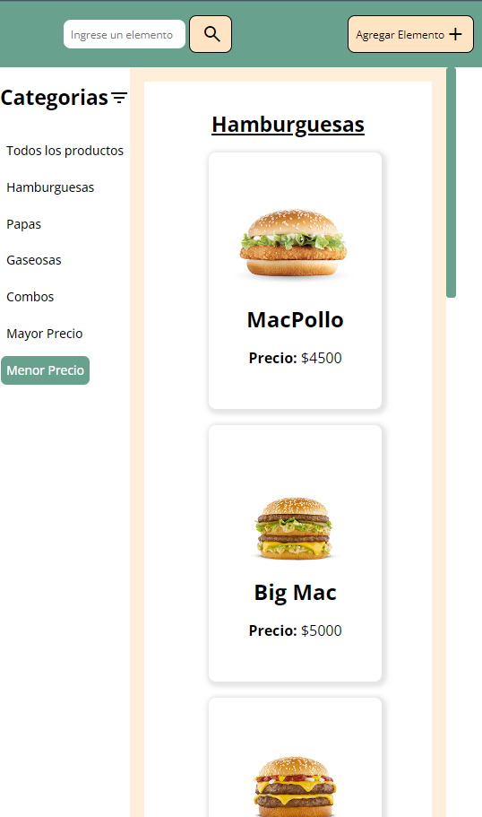

# Integrador Front

## Autor

**Matias Fernández** - Legajo: **49483** - Comisión **3K10**

## Descripción
Este proyecto es una aplicación web que permite gestionar productos, categorizarlos y realizar búsquedas en un listado. Incluye funcionalidades para agregar, modificar y eliminar productos, así como filtrarlos por categoría o precio. Además, utiliza una interfaz con diseño responsivo y manejo de `localStorage` para persistir los datos.

## Tecnologías utilizadas
- **HTML5** para la estructura de la aplicación.
- **CSS** para el diseño y estilos.
- **JavaScript** para la lógica del cliente.
- **Google Fonts** para las tipografías.
- **Material Symbols** para los íconos.
- **Vite** como herramienta de desarrollo y empaquetado.
- **SweetAlert2** para la visualización de alertas y confirmaciones interactivas.

## Instalación y configuración

### Prerrequisitos
- **Node.js** y **npm** instalados.

### Pasos de instalación
1. Clonar el repositorio:
   ```bash
   git clone https://github.com/matiFernandezz/IntegradorFront-Fernandez.git
   cd integrador-front
    ```
2. Instalar las dependencias del proyecto: 
    ```bash
    npm install
    ```
3. Iniciar el servidor de desarrollo:
    ```bash
    npm run dev
    ```
4. Abrir el proyecto en el navegador desde la siguiente URL: 
    ```bash
    http://localhost:8000
    ```
## Uso del Proyecto 
Una vez ejecutada la aplicación, puedes realizar las siguientes acciones:

- **Buscar un producto**: Utiliza la barra de búsqueda en el header para filtrar productos por su nombre.
- **Agregar un producto**: Haz clic en el botón "Agregar Elemento" para abrir el modal e introducir el nombre, imagen, precio y categoría de un nuevo producto.
- **Modificar o eliminar un producto**: Al seleccionar un producto desde la tienda, se abre un modal que te permite modificar sus datos o eliminarlo.
- **Filtrar productos**: Usa la barra lateral para filtrar productos por categoría o por precio (de mayor a menor o viceversa).

## Funcionalidades clave 
- **Búsqueda dinámica**: Filtra productos por nombre utilizando un campo de entrada.
- **Gestión de productos**: Agrega, modifica y elimina productos de la lista.
- **Filtrado por categoría**: Visualiza productos por tipo, como "Hamburguesas", "Papas", "Gaseosas", etc.
- **Ordenar por precio: Ordena los productos por su precio de forma ascendente o descendente.
- **Persistencia con localStorage**: Los productos se guardan en el localStorage del navegador, lo que permite que los datos permanezcan incluso después de cerrar la pestaña.

## Diseño Responsivo 
El diseño de la aplicación se adapta a diferentes tamaños de pantalla mediante media queries, lo que asegura que la interfaz sea accesible y funcional tanto en dispositivos móviles como en pantallas grandes.

### Media queries utilizadas
A continuación se explican algunos ejemplos de cómo se manejan diferentes resoluciones en el proyecto:

- **Pantallas pequeñas (dispositivos móviles)**: Cuando el ancho de la pantalla es de 768px o menor, algunos elementos como el texto "Buscar" en el botón de búsqueda desaparecen, dejando solo el ícono, para ahorrar espacio y mantener una interfaz limpia. Además, se configura el grid, para que hayan menos columnas y se ajuste a la pantalla.

- **Pantallas medianas y grandes**: Para pantallas más grandes, se muestran tanto el texto como los íconos, y la disposición de los elementos se ajusta para aprovechar el espacio disponible.

Este enfoque asegura que la aplicación sea visualmente atractiva y funcional en dispositivos como móviles, tablets, laptops y monitores de escritorio.

## Capturas de pantalla

### Página Principal

### Modal agregar producto

### Modal modificar producto

### Filtrado por Categoría

### Búsqueda por nombre

### Filtrado por Mayor Precio

### Filtrado por Menor Precio

### Pantalla Principal de 768px máximo

### Pantalla Principal de 600px máximo

